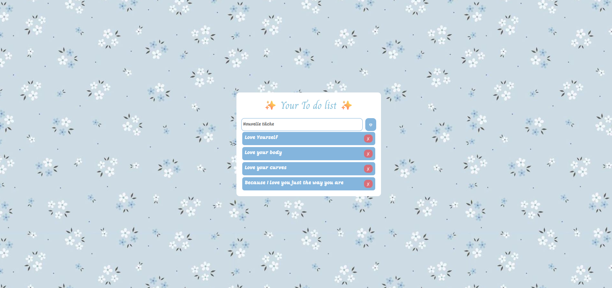

💖✨ A To-Do-list Fabulous Like You ✨💖

Bienvenue dans ✨Your To Do List✨ 🌸 — une application adorable, simple et efficace pour organiser ta journée avec style !  
Elle est douce, fluide, fleurie 🌼 et codée avec ❤️ en **HTML, CSS & JavaScript**.

---

## 🎀 Fonctionnalités

- 📥 Ajoute des tâches facilement
- ✅ Supprime-les une par une quand tu es une queen de la productivité
- 🎨 Design pastel et fleuri pour une ambiance cute et motivante
- ✨ Responsive et fluide sur tous les écrans

---

## 🌷 Aperçu

---

## 🛠️ Technologies utilisées

- 💅 **HTML5** — Structure de la page
- 🎨 **CSS3** — Design girly & responsive avec des polices stylées (_Charm_ & _Mogra_)
- 🧠 **JavaScript** — Gestion des tâches dynamiques
- 🖼️ **Image de fond** : `IMAGES/blue-flowers.jpg` (🌸 à ajouter dans ton dossier)

💌 Installation
Clone le repo :

bash
Copier
Modifier
git clone https://github.com/ton-user/to-do-list-girly.git
Ouvre le fichier index.html dans ton navigateur 💻

Ajoute une tâche et admire ta liste trop mimi 💖

🧁 Personnalisation

Tu veux rendre ta liste encore plus adorable ?

Change la photo de fond : remplace blue-flowers.jpg dans le CSS

Modifie les polices Google Fonts pour un autre look

Ajoute des animations CSS ou un mode nuit étoilé 🌙✨

Recrée ta To Do List à ton goût car tout ce qui compte, c'est toi 🌸

🫶 Crédits
🌸 Design & code : [Mey]

🎨 Polices : Google Fonts - Charm & Mogra

🌟 Let’s be fabulous and organized!

Parce que s’organiser ne veut pas dire être ennuyeuse 😉

💋 Stay cute & code on!
